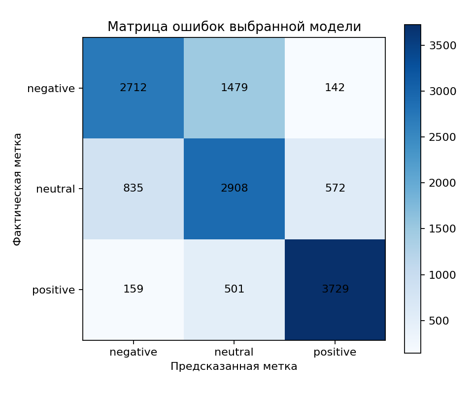

**Лабораторная работа №1: Токенизация, нормализация и анализ тональности русскоязычных отзывов**

**Студент:** Л. М. Соколов | КИ25-04-3М, 032540235  
**Преподаватель:** А. С. Кузнецов

---

# Содержание

1. [Цель](#1-цель)
2. [Задачи](#2-задачи)
3. [Ход работы](#3-ход-работы)
4. [Выводы](#4-выводы)
5. [Список использованных источников](#5-список-использованных-источников)

# 1. Цель

Цель работы — реализовать воспроизводимый анализ тональности русскоязычных отзывов с
собственной токенизацией и наблюдаемой нормализацией словаря.

# 2. Задачи

1. Подготовить и проверить корпус отзывов, исключив дубли и неоднозначные примеры.
2. Реализовать токенизацию и варианты нормализации: baseline, стемминг, лемматизацию,
   удаление стоп-слов и сведение синонимов.
3. Обучить одну документированную конфигурацию наивного байесовского классификатора.
4. Оценить модель и предоставить интерфейс анализа строки и UTF-8-файла.

# 3. Ход работы

## 3.1. Исходный корпус и подготовка данных

В работе используется сбалансированный трёхклассовый корпус русскоязычных отзывов RuReviews. Использован файл `women-clothing-accessories.3-class.balanced.csv`.
Несмотря на расширение `.csv`, он имеет формат TSV с двумя столбцами: `review` и `sentiment`.

Полный исходный файл представлен по пути `Laba1/data/rureviews.tsv`.
В нём содержится 90 000 строк: по 30 000 записей с исходными метками `negative`,
`neautral` и `positive`. Ошибочная метка `neautral` при подготовке заменяется на `neutral`.

## 3.2. Очистка и разбиение

Сначала из текста удаляются внешние пробелы. Единственный отзыв, состоящий из одного ASCII-пробела, после этого становится пустым и удаляется. Для каждого точного текста подсчитываются частоты меток: при единственной наиболее частой метке сохраняется один экземпляр, а при равенстве максимальных частот текст удаляется как неоднозначный. Результат сортируется по тексту и метке, поэтому очистка не зависит от порядка строк во входном файле.

На полном корпусе удалено 180 конфликтных текстов с ничьёй, а 215 конфликтов разрешены однозначным большинством. После удаления пустой записи и дедупликации осталось 86 913 уникальных непустых отзывов:

| Метка | Количество |
| --- | ---: |
| `negative` | 28 887 |
| `neutral` | 28 768 |
| `positive` | 29 258 |

Очищенный корпус разбит с `random_state=42` в два этапа: сначала 70 % / 30 %, затем временная часть пополам. Получено 60 839 обучающих, 13 037 валидационных и 13 037 тестовых примеров. Пересечения точных текстов между тремя частями отсутствуют. Обучение словаря и модели выполняется только на обучающей части.

Подготовка проверяет схему поставляемого файла и применяет одинаковые правила очистки и
разбиения при каждом запуске. Указанные числа служат воспроизводимым описанием
эксперимента.

## 3.3. Токенизация

Токенизатор реализован средствами стандартной библиотеки Python: регулярными выражениями и модулем `unicodedata`. Готовые NLP-токенизаторы не используются. Перед выделением токенов строка приводится к форме Unicode NFC.

В словарь попадают последовательности Unicode-букв, целые и десятичные числа с точкой или запятой, а также слова с внутренним дефисом (`-`, `‑`) или апострофом (`'`, `’`). Символы по краям слова, повторные дефисы, пунктуация, эмодзи и подчёркивания являются разделителями. Регистр и порядок исходных токенов сохраняются до этапа нормализации. Пустая строка или строка только из разделителей даёт пустой список.

Например, строка `ЁЛКА, Мир_world 12 3,14 по‑русски rock’n’roll` разбирается в токены `ЁЛКА`, `Мир`, `world`, `12`, `3,14`, `по‑русски`, `rock’n’roll`.

## 3.4. Нормализация словаря

Этот этап переводит токены в нижний регистр и унифицирует `ё` с `е`. Латинские слова, числа и неизвестные морфологическому анализатору русские слова сохраняются. Дефисные слова преобразуются посегментно с сохранением исходного вида дефиса.

Реализованы три взаимоисключающие ветви:

1. `none` — только общий этап, используемый как baseline;
2. `stem` — русский Snowball-стеммер из `snowballstemmer==3.1.1`;
3. `lemma` — наиболее вероятная известная словарная форма из `pymorphy3==2.0.6`.

Леммы повторяющихся токенов кэшируются внутри экземпляра нормализатора. Стемминг и лемматизация последовательно не применяются. Удаление стоп-слов и сведение синонимов включаются независимо после выбранной морфологической ветви.

Стоп-лист содержит 75 слов, отобранных из русского списка официального корпуса
[NLTK Data stopwords](https://raw.githubusercontent.com/nltk/nltk_data/gh-pages/packages/corpora/stopwords.zip).
Присутствующие в исходном списке отрицания `не` и `ни` намеренно не перенесены, поскольку
они способны менять тональность высказывания.

Карта синонимов содержит 10 групп из онлайн-словаря
[КартаСлов.ру](https://kartaslov.ru/синонимы-к-слову/хороший). Для каждой канонической
формы в JSON записана отдельная страница источника; из перечисленных там синонимов и
близких по смыслу слов оставлены по две однословные формы, встречающиеся в предметной
лексике товарных отзывов RuReviews. Стоп-слова, канонические формы и заменяемые
формы проходят ту же ветвь `none`, `stem` или `lemma`, что и анализируемый текст; тем
самым сравнение выполняется в едином нормализованном пространстве.

Команда `vocabulary` возвращает стабильный JSON с исходными и итоговыми токенами, частотами и активными этапами. Для фиксированного текста `Это отличное платье и прекрасная куртка` воспроизведены девять вариантов нормализации:

| Конфигурация | Итоговые токены | Частоты, отличные от 1 |
| --- | --- | --- |
| `none`, stopwords off, synonyms off | `это, отличное, платье, и, прекрасная, куртка` | — |
| `stem`, stopwords off, synonyms off | `эт, отличн, плат, и, прекрасн, куртк` | — |
| `stem`, stopwords off, synonyms on | `эт, хорош, плат, и, хорош, куртк` | `хорош: 2` |
| `stem`, stopwords on, synonyms off | `эт, отличн, плат, прекрасн, куртк` | — |
| `stem`, stopwords on, synonyms on | `эт, хорош, плат, хорош, куртк` | `хорош: 2` |
| `lemma`, stopwords off, synonyms off | `это, отличный, платье, и, прекрасный, куртка` | — |
| `lemma`, stopwords off, synonyms on | `это, хороший, платье, и, хороший, куртка` | `хороший: 2` |
| `lemma`, stopwords on, synonyms off | `это, отличный, платье, прекрасный, куртка` | — |
| `lemma`, stopwords on, synonyms on | `это, хороший, платье, хороший, куртка` | `хороший: 2` |

Во всех строках таблицы остальные перечисленные токены имеют частоту 1. Таблица показывает, что стоп-слова удаляются независимо от синонимии, а обе морфологические ветви являются альтернативами baseline и друг другу.

## 3.5. Представление и обучение

После нормализации каждый отзыв представляется строкой итоговых токенов, разделённых
пробелами. `CountVectorizer` строит частотный мешок униграмм только по обучающей части:
`ngram_range=(1, 1)`, `min_df=2`, `max_features=50 000`, `lowercase=False` и
`token_pattern=None`; разбиение строки выполняется эквивалентом `str.split`.

Рабочая команда обучает `MultinomialNB(alpha=1.0, fit_prior=True)` с фиксированной
конфигурацией `method=stem;stopwords=on;synonyms=off`. Она выбрана как простой вариант,
который явно включает морфологическую нормализацию и удаление служебных слов; синонимия
остаётся вариантом команды `vocabulary`, но не усложняет рабочее
обучение. Публичный порядок классов фиксирован как `negative`, `neutral`,
`positive`; вероятности переставляются в этот порядок независимо от внутреннего
представления классификатора.

Модель сохраняется атомарно в локальном пакете `joblib`. Пакет содержит конфигурацию
нормализации, vectorizer, классификатор, порядок классов и metadata: версии зависимостей,
идентификатор корпуса, SHA-256, seed `42` и дату обучения. Отдельного `schema_version` нет:
при загрузке проверяются обязательные поля и их типы, конфигурация, параметры vectorizer и
классификатора, порядок классов и полнота metadata; неполный или несовместимый пакет
завершается понятной ошибкой.

## 3.6. Пользовательский анализ

Команда `python -m Laba1` является единой публичной точкой входа. `vocabulary` показывает
наблюдаемые этапы нормализации, а `train --artifacts ...` готовит поставляемый полный
RuReviews, один раз обучает фиксированную модель и атомарно сохраняет пакет в
`artifacts/model.joblib`. Без `--verbose` команда печатает в
stdout только один JSON. С флагом `--verbose` этапы чтения и очистки, размеры частей,
обучение, test-метрики и пути результатов дополнительно выводятся в stderr без текстов
отзывов и трассировок.

Например, команда
`vocabulary --text 'Очень хорошее платье' --method lemma --stopwords --synonyms` возвращает
исходные токены `Очень`, `хорошее`, `платье`; итоговые токены `очень`, `хороший`, `платье`;
частоты и последовательность активных шагов. Это демонстрирует независимое включение
стоп-слов и синонимов в том же интерфейсе, которым пользуется обучение.

Команда `analyze` принимает один из аргументов `--text` и `--file`; файл читается
только в UTF-8. Она выводит объект с полями `label`, `probabilities` и `configuration`.
В `probabilities` всегда присутствуют `negative`, `neutral` и `positive`, а их сумма равна 1 с допуском `1e-6`. Метка выбирается по максимуму;
при равенстве преимущество имеет более ранний класс этого порядка. Таким образом, строка
и эквивалентный UTF-8-файл дают один и тот же JSON. Неизвестные слова допустимы: они могут
не попасть в словарь, но не прерывают анализ.

Пустой ввод или ввод только из разделителей, отсутствие или конфликт источников, неверная
UTF-8-кодировка, недоступный путь и повреждённый пакет модели сообщаются в stderr понятным
текстом и завершаются ненулевым кодом. 

## 3.7. Полное обучение

На проверенном полном корпусе команда `train` обучает документированную
конфигурацию `method=stem;stopwords=on;synonyms=off` на 60 839 примерах. Возможности
baseline, стемминга, лемматизации, удаления стоп-слов и синонимии демонстрируются отдельно
командой `vocabulary`.

Команда создаёт четыре результата: `model.joblib` нужен для последующего `analyze`,
`metrics.json` хранит test-метрики и числовую матрицу ошибок, `predictions.json` содержит
предсказания для всех примеров test-части, а `images/confusion_matrix.png` визуализирует
матрицу для отчёта. Пакет модели и JSON являются локальными производными файлами.

## 3.8. Итоговая оценка

После обучения модель единственный раз оценена на test-разбиении из 13 037
отзывов. Получены accuracy 0,717113, macro-precision 0,722003, macro-recall 0,716482 и
macro-F1 0,717036. Эти значения приведены без произвольного порога готовности.

| Метка | Precision | Recall | F1 | Support |
| --- | ---: | ---: | ---: | ---: |
| `negative` | 0,731786 | 0,625894 | 0,674711 | 4 333 |
| `neutral` | 0,594926 | 0,673928 | 0,631968 | 4 315 |
| `positive` | 0,839298 | 0,849624 | 0,844429 | 4 389 |

Матрица ошибок построена в фиксированном порядке строк и столбцов `negative`, `neutral`,
`positive`.

| Фактическая \ Предсказанная | negative | neutral | positive |
| --- | ---: | ---: | ---: |
| negative | 2 712 | 1 479 | 142 |
| neutral | 835 | 2 908 | 572 |
| positive | 159 | 501 | 3 729 |

Наиболее труден класс `neutral`: он чаще смешивается с соседними полярностями. Для
`negative` основной ошибкой является отнесение к нейтральному классу, а `positive`
распознаётся наиболее устойчиво.

## 3.9. Ограничения

Модель обучена только на закреплённом корпусе отзывов об одежде и аксессуарах, поэтому её
метрики не переносятся на другие домены, стили текста или распределения
классов. Автоматическая разметка исходного корпуса может содержать ошибки; очистка
разрешает лишь противоречия одинаковых текстов и не заменяет ручную экспертизу. Мешок
униграмм и MultinomialNB не моделируют порядок слов и дальние зависимости, поэтому
отрицания, ирония и контекстные оценки остаются потенциальными источниками ошибок.

# 4. Выводы

Реализован воспроизводимый конвейер анализа тональности с закреплённым корпусом,
собственным токенизатором, наблюдаемыми вариантами нормализации и пользовательским CLI.
Рабочая модель использует стемминг со стоп-словами без синонимов; на test-части она
достигла accuracy 0,717113 и macro-F1 0,717036. Код, команды, итоговая матрица ошибок и
числовые результаты согласованы с выполненным полным запуском.

# 5. Список использованных источников

1. Smetanin S., Komarov M. Sentiment Analysis of Product Reviews in Russian using
   Convolutional Neural Networks. IEEE CBI, 2019. DOI:
   [10.1109/CBI.2019.00062](https://doi.org/10.1109/CBI.2019.00062).
2. [Документация Python: `re`](https://docs.python.org/3/library/re.html) и
   [`unicodedata`](https://docs.python.org/3/library/unicodedata.html) — реализация
   токенизации и Unicode-нормализации.
3. [Документация scikit-learn](https://scikit-learn.org/stable/) —
   `CountVectorizer`, `MultinomialNB`, метрики и стратифицированное разбиение.
4. [Документация pandas](https://pandas.pydata.org/docs/) — загрузка и подготовка TSV.
5. [NLTK Data: корпус stopwords](https://raw.githubusercontent.com/nltk/nltk_data/gh-pages/packages/corpora/stopwords.zip) —
   источник 75 русских стоп-слов; отрицания `не` и `ни` исключены при предметной адаптации.
6. [КартаСлов.ру: словарь синонимов и близких по смыслу слов](https://kartaslov.ru/синонимы-к-слову/хороший) —
   источник проверенных групп; страницы каждой канонической формы указаны в JSON-ресурсе.
7. [Документация pymorphy3](https://pymorphy3.readthedocs.io/) и
   [snowballstemmer](https://pypi.org/project/snowballstemmer/) — лемматизация и
   стемминг русского текста.
8. [Документация joblib](https://joblib.readthedocs.io/) и
   [matplotlib](https://matplotlib.org/stable/) — сохранение модели и построение матрицы
   ошибок.
